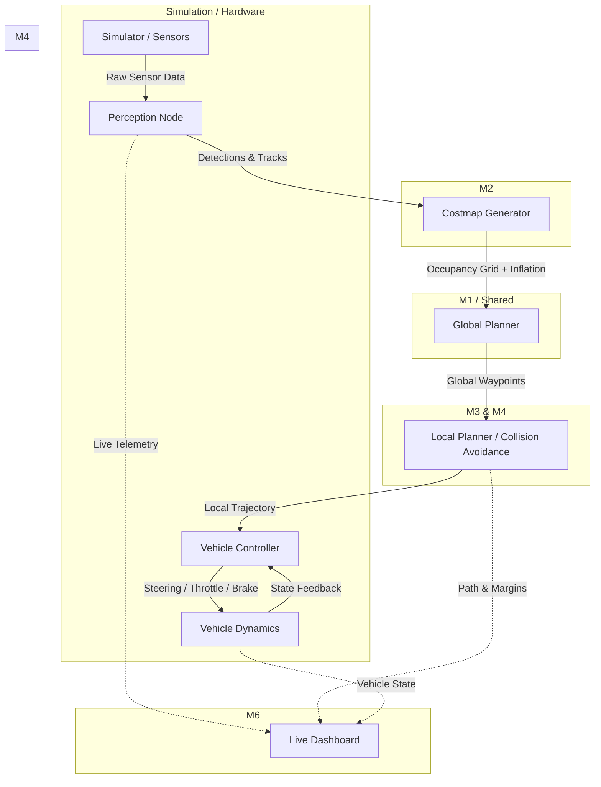

# <p align="center">MARG.AI</p>
<h2 align="center">Adaptive Path Planning & Collision Avoidance for Autonomous Vehicles on Unstructured Indian Roads 🇮🇳</h2>
<hr>
<h2 align="center">TEAM SARVOTTAM — Smart India Hackathon 2026 🌟</h2>

<h2 align="center">COMPLETE DESCRIPTION</h2>

### PS ID : SIH26037

### Team ID : 

### Organization : MathWorks

### Category : Software

### Theme : Smart Vehicles

### PS Title :
Adaptive Path Planning and Collision Avoidance for Autonomous Vehicles on Unstructured Indian Roads

### PS Description :
<b>Background:</b> Most autonomous-vehicle path planning stacks are built and validated on structured, well-marked roads (clear lanes, predictable traffic, disciplined right-of-way). Indian roads are largely unstructured — missing/faded lane markings, mixed traffic (cars, two-wheelers, autos, pedestrians, animals), potholes, encroachments, and unpredictable overtaking behaviour. This breaks the assumptions most planners rely on.

<b>Situation:</b> There is no readily available, adaptive path-planning and collision-avoidance solution that is validated specifically for unstructured Indian road conditions, combining real-time perception, dynamic re-planning, and safe motion control.

<b>Objective:</b> Design and simulate (with an optional small-scale hardware demo) an adaptive path-planning and collision-avoidance system that lets an autonomous vehicle navigate unstructured Indian roads safely and efficiently, reacting in real time to static and dynamic obstacles while respecting vehicle dynamics.


### Aim :
1. To build a path-planning + collision-avoidance stack that stays reliable when lanes, signage, and traffic discipline are absent or unreliable.
2. To demonstrate — in simulation, and ideally on a small-scale robot/rig — safe, real-time navigation through Indian-style unstructured scenarios (potholes, animals, mixed traffic, encroached roads).

### Summary :
The system perceives its surroundings (camera/LiDAR/simulated sensors), builds a live occupancy/cost map, plans a global route plus a continuously replanned local trajectory (e.g. Hybrid A* / RRT* for global, DWA/MPC for local), and executes it through a controller that respects the vehicle's kinematic and dynamic limits. A dashboard visualizes the planned path, detected obstacles, and safety margins in real time.

### Objectives :
1. Perceive and classify static & dynamic obstacles (potholes, animals, pedestrians, vehicles, encroachments) from sensor/simulated data.
2. Build and continuously update a costmap/occupancy grid reflecting unstructured road reality (no fixed lanes).
3. Generate a global path and a locally re-planned, collision-free trajectory in real time as new obstacles appear.
4. Execute the trajectory through a controller that respects vehicle dynamics (turning radius, acceleration limits, braking distance).
5. Handle edge cases specific to Indian roads: sudden pedestrian/animal crossing, potholes, narrow gaps, oncoming wrong-side traffic.
6. Quantitatively evaluate safety (collision rate), efficiency (path length/time), and comfort (jerk/acceleration) across test scenarios.
7. Provide a live visualization dashboard for judges/demo audiences to see planning + avoidance decisions in real time.
8. (Stretch) Validate on a small-scale autonomous rig / robot car in a physical obstacle course.

### Status :
- [ ] Literature review & approach finalized
- [ ] Simulation environment set up
- [ ] Perception module (obstacle/pothole detection)
- [ ] Global path planner
- [ ] Local planner + collision avoidance
- [ ] Controller / vehicle dynamics integration
- [ ] Dashboard / visualization
- [ ] Test scenario suite + evaluation metrics
- [ ] Demo video + final PPT

### Proposed Architecture (high level) :
```
Sensors/Sim (Camera, LiDAR, GPS, IMU)
        │
        ▼
Perception Module ──► Occupancy / Cost Map
        │                        │
        ▼                        ▼
   Object Tracker        Global Path Planner (Hybrid A* / RRT*)
        │                        │
        └─────────► Local Planner / Collision Avoidance (DWA / MPC)
                             │
                             ▼
                     Vehicle Controller (steering, throttle, brake)
                             │
                             ▼
                  Simulator / Vehicle  ──►  Live Dashboard
```

### Tech Stacks Used :
⦿ <b>Simulation / Core Algorithms :</b>
* [](https://www.mathworks.com/) [](https://www.mathworks.com/products/simulink.html) [](https://www.python.org/)

⦿ <b>Robotics / Middleware :</b>
* [](https://www.ros.org/) [](https://gazebosim.org/)

⦿ <b>Perception :</b>
* [](https://opencv.org/) [](https://pytorch.org/)

⦿ <b>Dashboard / Visualization :</b>
* [](https://react.dev/) [](https://plotly.com/)

⦿ <b>Version Control / PM :</b>
* [](https://github.com/) [](https://www.notion.so/)


### Important URLs :
⭐️ <b>Repo :</b> [Add GitHub link]

⭐️ <b>Idea PPT :</b> [Add link]

⭐️ <b>Demo Video :</b> [Add link]

⭐️ <b>Architecture Doc :</b> [Add link]

---

## Project Created & Maintained By

## :heart: Team [Your Team Name]
1. [Member 1 — Team Lead / Integration](https://github.com/)
2. [Member 2 — Perception & Computer Vision](https://github.com/)
3. [Member 3 — Path Planning Algorithms](https://github.com/)
4. [Member 4 — Control & Collision Avoidance](https://github.com/)
5. [Member 5 — Simulation & Testing](https://github.com/)
6. [Member 6 — Dashboard, Docs & Presentation](https://github.com/)



### How-to-run
- Clone this repository.
- See `/docs/setup.md` for environment setup (MATLAB/Simulink + Python/ROS2 dependencies).
- Run the simulation scenario suite: `[command TBD by Sprint 1]`.
- Launch the dashboard: `[command TBD]`.

## Support
💙 If you like this project, give it a ⭐ and share it with friends!
Contributions, issues and PRs from teammates are welcome — see `ROADMAP.md` for open issues.
