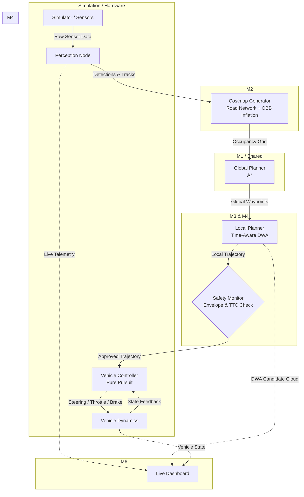

# MARG.AI
## Adaptive Path Planning & Collision Avoidance for Autonomous Vehicles on Unstructured Indian Roads 🇮🇳
### TEAM SARVOTTAM — Smart India Hackathon 2026 🌟

---

## 📋 COMPLETE DESCRIPTION

- **PS ID:** SIH26037
- **Team ID:** [Your Team ID]
- **Organization:** MathWorks
- **Category:** Software
- **Theme:** Smart Vehicles
- **PS Title:** Adaptive Path Planning and Collision Avoidance for Autonomous Vehicles on Unstructured Indian Roads

### Problem Statement Description
**Background:** Most autonomous-vehicle path planning stacks are built and validated on structured, well-marked roads (clear lanes, predictable traffic, disciplined right-of-way). Indian roads are largely unstructured — missing/faded lane markings, mixed traffic (cars, two-wheelers, autos, pedestrians, animals), potholes, encroachments, and unpredictable overtaking behaviour. This breaks the assumptions most planners rely on.

**Situation:** There is no readily available, adaptive path-planning and collision-avoidance solution that is validated specifically for unstructured Indian road conditions, combining real-time perception, dynamic re-planning, and safe motion control.

**Objective:** Design and simulate (with an optional small-scale hardware demo) an adaptive path-planning and collision-avoidance system that lets an autonomous vehicle navigate unstructured Indian roads safely and efficiently, reacting in real time to static and dynamic obstacles while respecting vehicle dynamics.

### Aim
1. To build a path-planning + collision-avoidance stack that stays reliable when lanes, signage, and traffic discipline are absent or unreliable.
2. To demonstrate — in simulation, and ideally on a small-scale robot/rig — safe, real-time navigation through Indian-style unstructured scenarios (potholes, animals, mixed traffic, encroached roads).

### Summary
The system perceives its surroundings, builds a live costmap with road-network boundaries, plans a global route (A*), and continuously replans a local trajectory (Time-Aware DWA with OBB geometry). It executes the path through a Pure Pursuit controller guarded by an independent Safety Monitor. A live dashboard visualizes the DWA sampling cloud, planned path, and safety margins in real time.

### Objectives
1. Perceive and classify static & dynamic obstacles (potholes, animals, pedestrians, vehicles).
2. Build and continuously update a costmap reflecting unstructured road reality (curbs, off-road lethal zones).
3. Generate a global path and a locally re-planned, collision-free trajectory in real time.
4. Execute the trajectory through a controller that respects vehicle dynamics (turning radius, acceleration limits).
5. Handle edge cases: sudden pedestrian/animal crossing, pass-abortion on narrow roads, sensor noise.
6. Quantitatively evaluate safety (TTC, clearance), efficiency (path length), and comfort (jerk).
7. Provide a live visualization dashboard for judges to see planning decisions in real time.

### Status
- [x] Literature review & approach finalized
- [x] Simulation environment & deterministic pipeline set up
- [x] Perception module (Ground truth + Noisy sensor simulation)
- [x] Global path planner (A* with dynamic replanning)
- [x] Local planner + collision avoidance (Time-Aware DWA with OBB geometry)
- [x] Controller / vehicle dynamics integration (Pure Pursuit + Kinematic Bicycle)
- [x] Dashboard / visualization (Live Matplotlib Telemetry)
- [x] Test scenario suite + evaluation metrics (6 Scenarios + Auto-generated Report)
- [ ] Demo video + final PPT

---

## 🏗️ Proposed Architecture



---

## 💻 Tech Stacks Used

**Simulation / Core Algorithms:**


**Robotics / Middleware:**


**Perception:**


**Dashboard / Visualization:**


**Version Control / PM:**


---

## 🔗 Important URLs

- ⭐️ **Repo:** [Add GitHub link]
- ⭐️ **Idea PPT:** [Add link]
- ⭐️ **Demo Video:** [Add link]
- ⭐️ **Architecture Doc:** [Add link]

---

## 🚀 How to Run

1. **Clone the repository:**
   ```bash
   git clone <your-repo-url>
   cd marg.ai
   ```

2. **Setup the environment:**
   ```bash
   python -m venv venv
   source venv/bin/activate  # On Windows: venv\Scripts\activate
   pip install -r requirements.txt
   ```

3. **Run the Full Evaluation Suite (Headless):**
   Generates `metrics_report.md` and trajectory plots for all 6 scenarios.
   ```bash
   python -m scripts.run_all_scenarios
   ```

4. **Run the Live Dashboard (Interactive):**
   Opens a real-time window showing the costmap, A* path, and DWA sampling cloud.
   ```bash
   python -m scripts.run_live_demo city_roads
   ```

---

## 👥 Project Created & Maintained By

### :heart: Team Sarvottam
1. **[Member 1]** — Team Lead / Integration
2. **[Member 2]** — Perception & Computer Vision
3. **[Member 3]** — Path Planning Algorithms
4. **[Member 4]** — Control & Collision Avoidance
5. **[Member 5]** — Simulation & Testing
6. **[Member 6]** — Dashboard, Docs & Presentation

---

## Support
💙 If you like this project, give it a ⭐ and share it with friends!
Contributions, issues and PRs from teammates are welcome.
